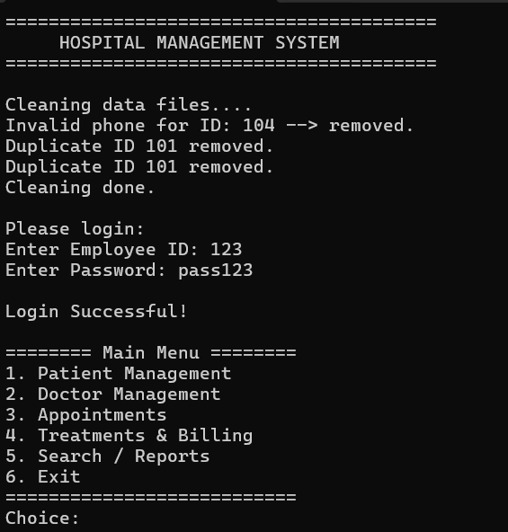
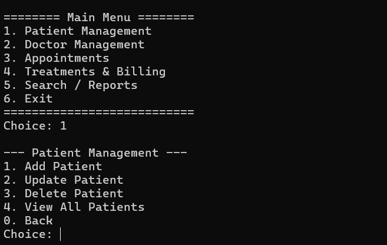
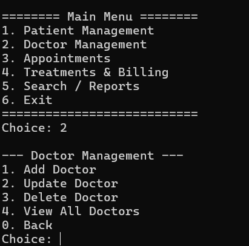
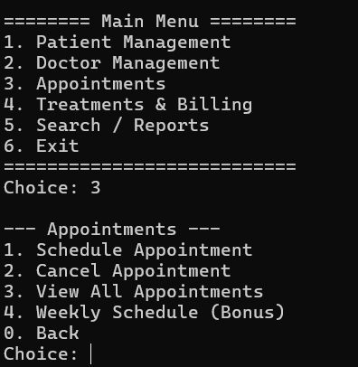

# Hospital Management System

A console-based Hospital Management System developed in C++ using Object-Oriented Programming and File Handling concepts.

## Features

- Patient management
- Doctor management
- Appointment scheduling
- Data storage using files
- Menu-driven interface

## Technologies Used

- C++
- OOP
- File Handling

## Screenshots

### Main Menu

### Patient Management

### Doctor Management

### Appointment Management

## Author

Abdullah Fahd Ali
